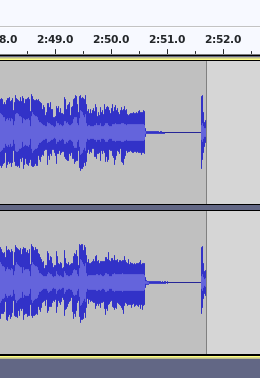

## ICY Stream Ripper
#### ICY protocol based stream ripper

**early development stage** - I won't accept any PRs

AAC works. By any chance mp3 may work as well. I'm saving data redneck style. I haven't tested that yet.


### Inner workings
Ice-cast stream begins with http GET query.
*Icy-MetaData* header is provided in request which enables sending metadata from server-side.
An *icy-metaint* header is returned in response which implies length of data chunks in the subsequent binary stream.
This connection is persisted and binary data starts to flow.

After each data chunk, a chunk of metadata is sent. First byte of metadata indicates the length of the rest of it. To be more precise:
```python
meta_length = ord(first_meta_byte) * 16
```

Metadata is Null-padded, it's entries are separated by semicolon, whilst each key-value entry is separated by an equation sign.

### Detecting song change

Currently, song border is deduced from title change in received metadata. It's not ideal but it somehow works.
One whole chunk of data is withheld that way songs don't overlap as much.

Let's consider the following example, this rip unfortunately catches the beginning of the next song.




But there is hope. Silence detection is on the way.


### Legal

I don't intend to cause harm or financial loss to di.fm. I just use their stream as a real-world case for development purposes - that is why you may find their brand scattered throughout current code.
(btw. I highly recommend subscribing). After I stabilize the project all will be cleaned up nicely.
